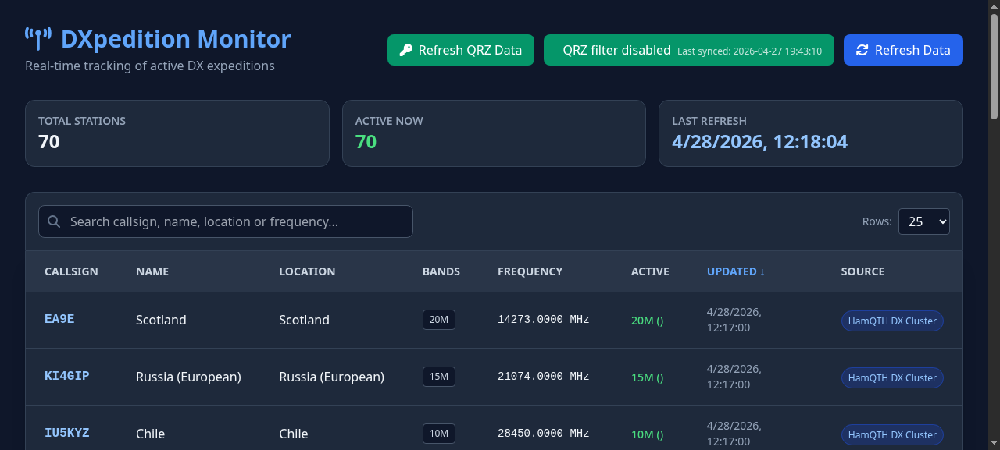

# DXpedition Monitor

A real-time monitoring tool for tracking active DXpeditions across various amateur radio data sources. Aggregates data from DX Summit, DX Cluster, DX News, and HamQTH into a unified dashboard with QRZ.com QSO history integration.



## Features

- **Multi-Source Aggregation** — Pulls live data from DX Summit, DX Cluster, DX News, and HamQTH
- **Real-Time Dashboard** — Clean web interface showing active stations, frequencies, and modes
- **QRZ QSO Integration** — Import your QRZ.com logbook to filter and highlight stations you've contacted
- **REST API** — FastAPI backend for easy integration with other tools
- **CLI Tool** — Quick terminal access with JSON or table output
- **Flexible Configuration** — Adjustable data staleness thresholds, retry policies, and source toggles

## Architecture

| Layer | Technology |
|-------|-----------|
| Backend | FastAPI / Python 3.12+ |
| Data Fetchers | `aiohttp` + `BeautifulSoup4` (async) |
| Frontend | Static HTML/JS dashboard served by the API |
| Config | `.env` via `python-dotenv` |
| QRZ Sync | Logbook API with ADIF parsing & JSONL cache |

## Installation

### Local Development

1. **Clone the repository**

   ```bash
   git clone <repository-url>
   cd DXscraper
   ```

2. **Install dependencies**

   ```bash
   pip install -r requirements.txt
   ```

3. **Configure environment**

   Create a `.env` file in the root directory:

   ```env
   DXPEDITION_MAX_AGE_SECONDS=3600
   DXPEDITION_REQUEST_TIMEOUT=30
   DXPEDITION_RETRY_ATTEMPTS=3
   DXPEDITION_RETRY_DELAY_SECONDS=1.0
   ```

4. **Run the Web API**

   ```bash
   export PYTHONPATH=$PYTHONPATH:.
   uvicorn src.api:app --reload
   ```

   Dashboard is available at [http://localhost:8000](http://localhost:8000).

5. **Run the CLI Tool**

   ```bash
   export PYTHONPATH=$PYTHONPATH:.
   python src/main.py --format table
   python src/main.py --format json --source dx_summit
   python src/main.py --debug-qrz   # test QRZ API credentials
   ```

### Docker Deployment

```bash
# Build
docker build -t dx-scraper .

# Run
docker run -p 8000:8000 dx-scraper

# With custom config
docker run -p 8000:8000 -e DXPEDITION_MAX_AGE_SECONDS=7200 dx-scraper
```

## Testing

```bash
export PYTHONPATH=$PYTHONPATH:.
pytest                          # all tests
pytest tests/test_service.py -v  # single file
```

`pytest.ini` sets `asyncio_mode = auto` and `pythonpath = .`.

## API Endpoints

| Method | Endpoint | Description |
|--------|----------|-------------|
| `GET` | `/` | Web dashboard |
| `GET` | `/data` | JSON summary of current DXpeditions |
| `GET` | `/qrz-status` | QRZ credentials status |
| `POST` | `/qrz-token` | Store QRZ.com API credentials |
| `GET` | `/qrz-sync` | Sync QRZ logbook data |
| `GET` | `/qrz-cache` | Cached QRZ QSO data |

## Configuration

| Variable | Default | Description |
|----------|---------|-------------|
| `DXPEDITION_MAX_AGE_SECONDS` | `3600` | Max age of data before staleness |
| `DXPEDITION_REQUEST_TIMEOUT` | `30` | HTTP request timeout (seconds) |
| `DXPEDITION_RETRY_ATTEMPTS` | `3` | Retry attempts for failed requests |
| `DXPEDITION_RETRY_DELAY_SECONDS` | `1.0` | Delay between retries |

QRZ credentials are stored in `~/.config/dxscraper/dxscraper_config.json`, not in `.env`.

## License

MIT
