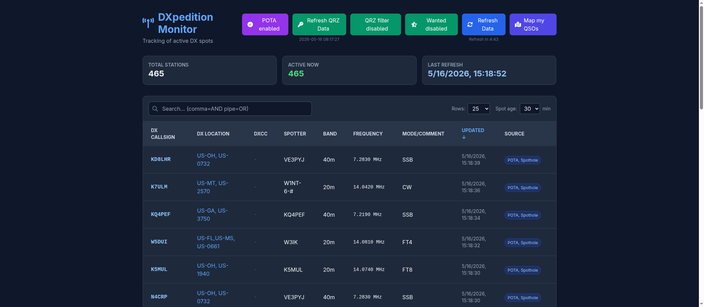
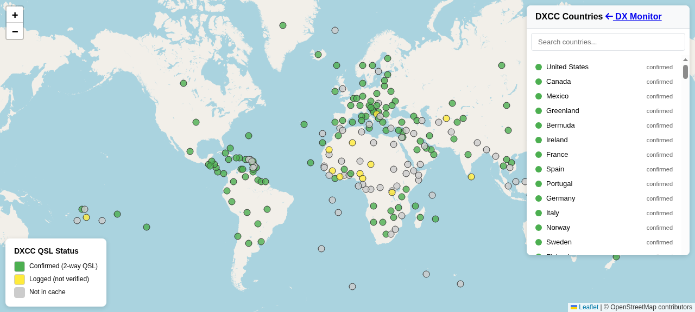

# DXpedition Monitor

A live dashboard for ham-radio DX spots you have not already worked. It aggregates cluster and news sources, overlays your QRZ.com log, and adds **potential spots** for DXpeditions that should be QRV today even if nobody has spotted them yet.





## Features

- **Multi-source aggregation** — DX Summit, Spothole (DX Cluster), HamQTH, POTA, and NG3K, with callsign deduplication
- **Potential spots** — NG3K announced DXpeditions that are scheduled to be QRV *today* appear as rows with a yellow `potential` marker and `not spotted` in Updated. Live spots always win; QRZ / Wanted / search still apply; spot-age does not hide them
- **Real-time dashboard** — Vue 3 + Tailwind UI with auto-refresh, sortable columns, and pagination
- **QRZ logbook** — Import your QRZ.com log to hide confirmed QSOs and highlight needed DXCC. Token lives in the OS keyring, not on disk
- **Wanted filter** — Three-way toggle: off → highlight needed DXCC in red → show only needed DXCC
- **QRZ filter** — Hide callsigns already confirmed on that band
- **POTA toggle** — Include or exclude Parks On The Air activations; park references link to pota.app
- **Spot age** — 10 / 20 / 30 / 60 minute cutoff on the dashboard (potential rows are exempt)
- **Search** — Comma = AND, pipe = OR. Click Band, Mode, or DX Location to append an AND term. Search `potential` to list unspotted DXpeditions
- **DXCC QSL map** — Leaflet map of confirmed countries from your QRZ log (Big CTY, 345 entities)
- **REST API + CLI** — JSON for other tools; `python src/main.py --format table` for a terminal view

## Data sources

| Key | Display name | What it contributes |
|-----|--------------|---------------------|
| `dx_summit` | DX Summit | Live cluster spots (CSV) |
| `dx_cluster` | Spothole | Live cluster spots |
| `hamqth` | HamQTH | Live spots |
| `pota` | POTA | Park activations |
| `ng3k` | NG3K | Today's announced operations as potential spots |

Prefix-only NG3K calendar entries (`EA8`, `3B8`, …) are skipped unless the description names a real operating call (`as 3B8/SQ9UM`). Upcoming or expired operations are not shown.

## Architecture

| Layer | Technology |
|-------|-----------|
| Backend | FastAPI / Python 3.12 |
| Fetchers | `aiohttp` (async) |
| Frontend | Vue 3 + Tailwind (static files served by the API) |
| Config | `.env` via `python-dotenv` |
| QRZ sync | Logbook API, ADIF parse, JSONL cache |

## Installation

### Local development

```bash
git clone https://github.com/xsnrg/DX-scraper.git
cd DX-scraper
pip install -r requirements.txt
```

Optional `.env` in the repo root:

```env
DXPEDITION_MAX_AGE_SECONDS=3600
DXPEDITION_REQUEST_TIMEOUT=30
DXPEDITION_RETRY_ATTEMPTS=3
DXPEDITION_RETRY_DELAY_SECONDS=1.0
```

Start the dashboard:

```bash
./run_web.sh
```

That is equivalent to `PYTHONPATH=. uvicorn src.api:app --reload`. Open [http://localhost:8000](http://localhost:8000).

CLI:

```bash
PYTHONPATH=. python src/main.py --format table
PYTHONPATH=. python src/main.py --format json --source ng3k
PYTHONPATH=. python src/main.py --debug-qrz
```

`--source` accepts `dx_summit`, `dx_cluster` (alias `dxcluster`), `hamqth`, `pota`, `ng3k`.

### Docker

```bash
docker run -p 8000:8000 ghcr.io/xsnrg/dx-scraper:latest
docker run -p 8000:8000 -e DXPEDITION_MAX_AGE_SECONDS=7200 ghcr.io/xsnrg/dx-scraper:latest
```

Dashboard: [http://localhost:8000](http://localhost:8000).

## Testing

`pytest.ini` sets `asyncio_mode = auto` and `pythonpath = .`. Markers are applied automatically: Playwright UI tests are `acceptance` (need the API on port 8000); everything else is `unit`.

```bash
pytest -m "not acceptance"   # unit tests (~324)
pytest -m acceptance         # UI tests (~82); start ./run_web.sh first
pytest tests/test_ng3k.py -v
```

## API endpoints

| Method | Endpoint | Description |
|--------|----------|-------------|
| `GET` | `/` | Web dashboard |
| `GET` | `/data` | JSON summary of current spots. Optional `?exclude_sources=POTA` |
| `GET` | `/qrz-status` | QRZ credentials status |
| `POST` | `/qrz-token` | Store QRZ.com API credentials |
| `GET` | `/qrz-sync` | Sync QRZ logbook |
| `GET` | `/qrz-cache` | Cached confirmed call/band/DXCC triples |
| `GET` | `/qrz-dxcc-numbers` | Confirmed DXCC numbers (Wanted filter) |
| `GET` | `/qrz-all-data` | All cached QSOs (any status) |
| `GET` | `/qrz-qso-data` | Full cached QSO records |
| `GET` | `/dxcc-map.html` | DXCC QSL status map |

## Configuration

| Variable | Default | Description |
|----------|---------|-------------|
| `DXPEDITION_MAX_AGE_SECONDS` | `3600` | Drop live spots older than this (potential spots are kept) |
| `DXPEDITION_REQUEST_TIMEOUT` | `30` | HTTP timeout in seconds |
| `DXPEDITION_RETRY_ATTEMPTS` | `3` | Retries per source |
| `DXPEDITION_RETRY_DELAY_SECONDS` | `1.0` | Delay between retries |

QRZ storage:

- **Callsign** — `~/.config/dxscraper/dxscraper_config.json` (`0o600`)
- **API token** — OS keyring (Keychain / SecretService / Credential Locker), never written to disk

## License

MIT
